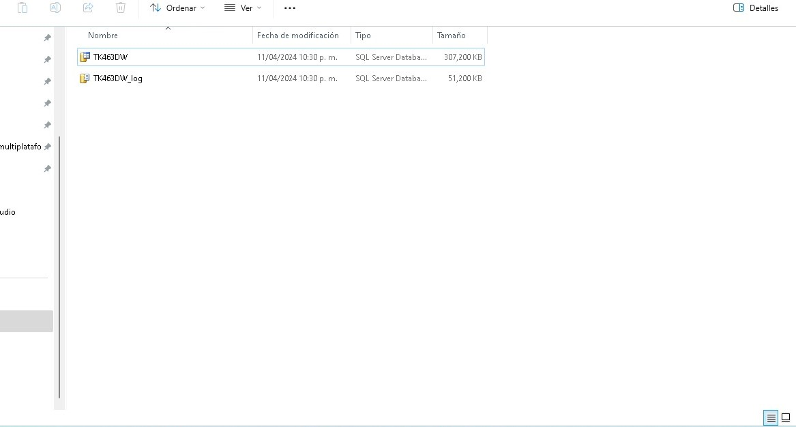

# Cargar la base de datos:
**pagina de microsoft* PODEMOS OBTENERLAS*

instalar el backup de la respectiva base de datos, 2012. 
Realicé un backup.

Disco local C cree una carpeta con el nombre: TK463


***
ejecutamos el siguiente script:
 
```sql
USE master;
IF DB_ID('TK463DW') IS NOT NULL
DROP DATABASE TK463DW;
GO
CREATE DATABASE TK463DW
ON PRIMARY
(NAME = N'TK463DW', FILENAME = N'C:\TK463\TK463DW.mdf',
SIZE = 307200KB , FILEGROWTH = 10240KB )
LOG ON
(NAME = N'TK463DW_log', FILENAME = N'C:\TK463\TK463DW_log.ldf',
SIZE = 51200KB , FILEGROWTH = 10%);
GO
ALTER DATABASE TK463DW SET RECOVERY SIMPLE WITH NO_WAIT;
GO
```

estructura de archivos 


***

# EVIDENCIA
## Creacion diagrama

Se obserba el diagrama  con la estructura determinada 


